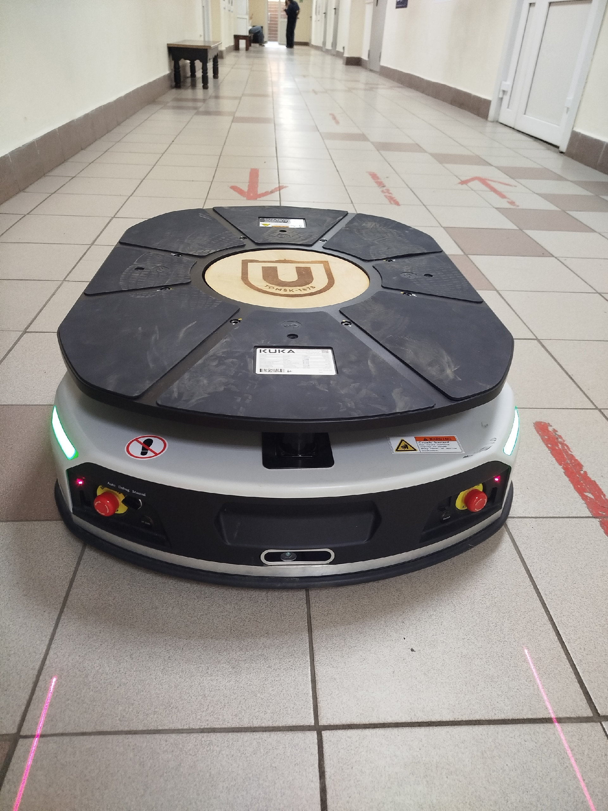
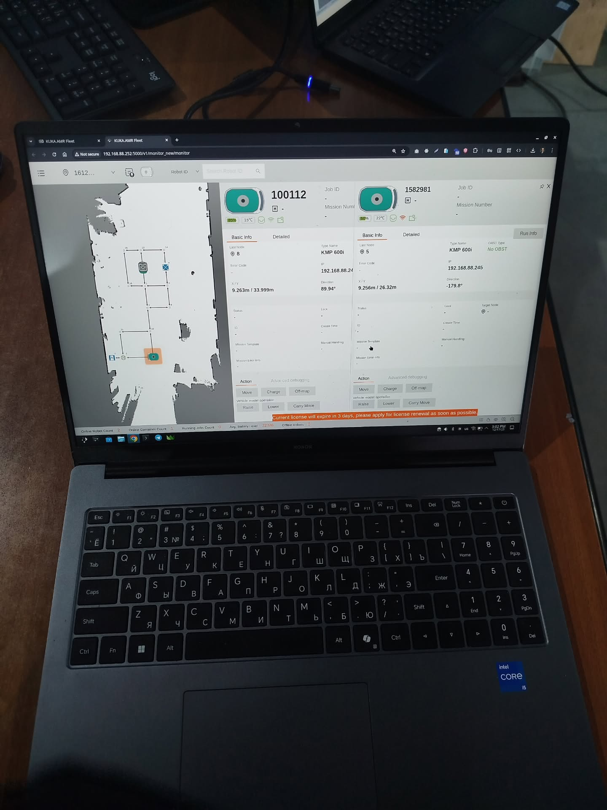

# KAPI — KUKA AMR Fleet Python API

<p align="center">
  
  
</p>

<p align="center">
  <b>Python module for controlling KUKA AMR Fleet robots</b>
</p>


---

### About

**KAPI** is a lightweight Python module for interacting with KUKA AMR Fleet management system. It provides a simple interface to control autonomous mobile robots (AMR), manage maps, dispatch missions, and monitor robot status.

### Features

- Login & token-based authentication
- Query robot list and real-time robot info
- Get maps with floor details
- Dispatch missions to robots
- Charge robots remotely
- Cancel running missions

### Requirements

- Python 3.6+
- `requests` library

### Installation

```bash
git clone https://github.com/yagafarov/kapi.git
cd kapi
pip install requests
```

### Quick Start

```python
from kapi import KUKA

# Connect to KUKA Fleet
k = KUKA("192.168.88.252")
k.login()

# Get all robots
robots = k.getRobots()
for r in robots:
    print(r)

# Get all maps with floors
maps = k.getMaps()
for m in maps:
    print(m["mapName"], m["mapCode"])
```

### API Reference

#### `KUKA(ip, port=5000)`

Create a connection to the KUKA Fleet system.

| Parameter | Type | Default | Description |
|-----------|------|---------|-------------|
| `ip` | str | — | KUKA server IP address |
| `port` | int | 5000 | Web interface port |

#### `login(username, password)`

Authenticate and obtain a session token.

```python
k.login("admin", "e3afed0047b08059d0fada10f400c1e5")
```

#### `getRobots()`

Returns a list of all registered mobile robots.

```python
robots = k.getRobots()
```

#### `getRobotInfos(robot_ids)`

Get real-time information for specific robots.

| Parameter | Type | Description |
|-----------|------|-------------|
| `robot_ids` | list | List of robot ID strings |

```python
info = k.getRobotInfos(["100112"])
```

#### `getMaps()`

Returns all maps with their floor details attached.

```python
maps = k.getMaps()
for m in maps:
    for floor in m["floors"]:
        print(f"  {floor['floorName']} — {floor['floorLength']}m x {floor['floorWidth']}m")
```

#### `dispatch_mission(robot_id, target_node_label, map_code, ...)`

Send a robot to a target node.

| Parameter | Type | Default | Description |
|-----------|------|---------|-------------|
| `robot_id` | str | — | Robot ID |
| `target_node_label` | str | — | Target node label on the map |
| `map_code` | str | — | Map code |
| `floor_number` | str | "2222" | Floor number |
| `template_code` | str | "T4" | Workflow template code |
| `priority` | int | 2 | Mission priority |

```python
k.dispatch_mission(
    robot_id="100112",
    target_node_label="10",
    map_code="2026"
)
```

#### `chargeRobot(robot_id, target_level=100)`

Send a robot to charge.

| Parameter | Type | Default | Description |
|-----------|------|---------|-------------|
| `robot_id` | str | — | Robot ID |
| `target_level` | int | 100 | Target battery percentage |

```python
k.chargeRobot("1582981", 80)
```

#### `cancel_mission(upstream_number)`

Cancel a running mission.

```python
k.cancel_mission("ed555ae2-6e64-4ee0-b3d1-104c5a7804a3")
```

#### `get_mission_status(upstream_number, robot_id)`

Check the status of a mission.

```python
status = k.get_mission_status(upstream_number="abc123")
```

### Example Workflow

```python
from kapi import KUKA
import time

k = KUKA("192.168.88.252")
k.login()

# Check available robots
robots = k.getRobots()
print(f"Found {len(robots)} robots")

# Get real-time info
info = k.getRobotInfos(["100112"])
print(f"Battery: {info[0].get('batteryLevel')}%")

# Send robot to a node
result = k.dispatch_mission(
    robot_id="100112",
    target_node_label="10",
    map_code="2026"
)

# Wait and send to another node
time.sleep(5)
result = k.dispatch_mission(
    robot_id="100112",
    target_node_label="7",
    map_code="2026"
)
```

---

### Author

**Yagafarov Dinmukhammad**
🌐 [www.robotsoz.uz](https://www.robotsoz.uz)

